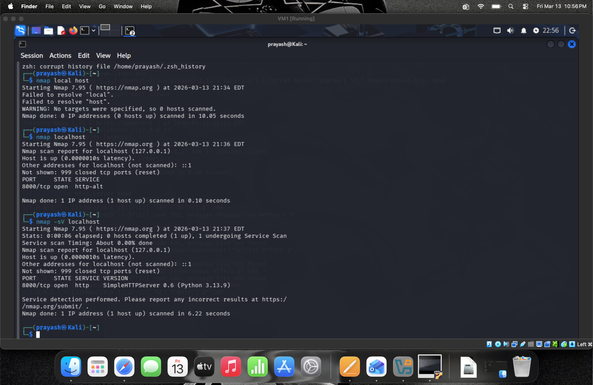

# Nmap Network Scan Lab

## Objective
The goal of this lab was to practice basic network scanning using Nmap in Kali Linux.

## Tools Used
- Kali Linux
- Nmap
- VirtualBox

## Lab Setup
A temporary HTTP server was started using Python on port 8000.  
The machine was then scanned using Nmap to identify open ports and services.

## Commands Used

Start HTTP server:

```
python3 -m http.server 8000
```

Run Nmap scan:

```
nmap localhost
```

Service detection scan:

```
nmap -sV localhost
```

## Results
Nmap successfully detected the open port running the HTTP service.

## Screenshots

### HTTP Server Running


### Nmap Scan Result

